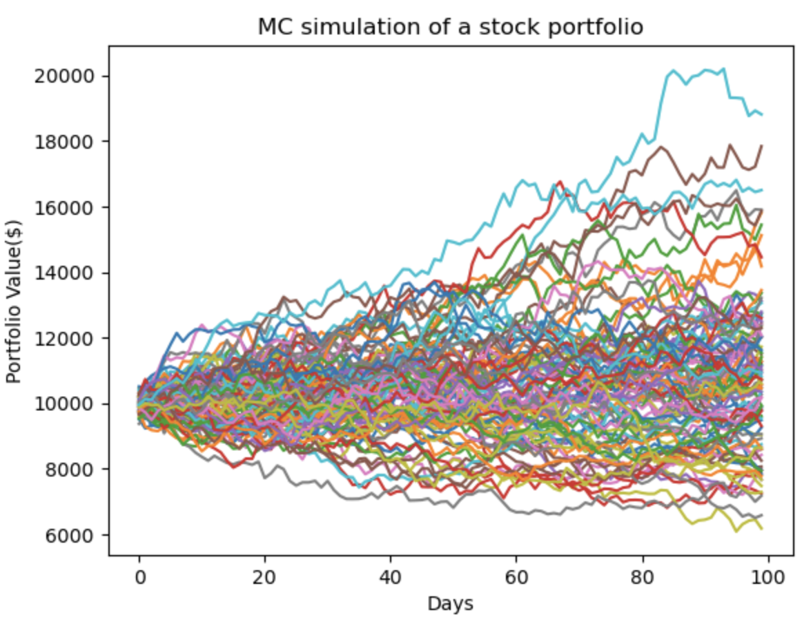

# Data Scientist    
#### Technical Skills: 
- **R (dplyr, ggplot 2, shiny, tidyr)**
- **Python (Pandas, NumPy, Seaborn, Matplotlib, Scikit-Learn)**
- **SQL**

## Education			        		
B.A., Applied Mathematics in Statistcs and Economics | McGill University (_June 2024_)

## Summary 
I have recently graduated from McGill University where I double majored in Applied Mathematics in Statistics and Economics. During my time as a student I was exposed to a variety of theoretical and practical topics in Data Science:

- Probability
- Statistics
- Statistical Computing 
- Applied Regression
- Generalized Linear Models (data/model fitting and quality assurance)
- Stochastic Processes and Modelling (discrete and continuous)
- Sampling Theory and Applications 
- Fundamentals of Statistical Learning (i.e., mathematics for machine learning)
- Econometrics

## Work Experience
**Trading Analyst Intern @ Spectra FX Solutions, NY, United States (_Summer 2023_)**
- Continuously analyzed and tracked currency pair positions across multiple markets, leveraging advanced risk management tools to optimize portfolio exposure and minimize potential losses, leading to a 15% reduction in currency risk.
- Led comprehensive global market research and data analysis on key economic indicators (e.g., interest rates, inflation, GDP) to forecast currency fluctuations, providing actionable insights that improved trading decisions and contributed to an subtle increase in trading accuracy.
- Developed and proposed quantitative strategies for currency options traders, using statistical models and market simulations, reducing risk exposure by 20% and enhancing profit margins by 10% through more effective hedging techniques.
- Facilitated high-value client transactions, executing strategies that generated tens of thousands of dollars in revenue, through strategic client engagement and market timing.

**Financial Analyst Intern @ Makor Capital, Tel Aviv, Israel (_Summer 2021_)**
- Conducted a comprehensive analysis of financial benchmarks for prospective SPAC and M&A deals, evaluating performance metrics against industry standards to identify high-potential opportunities and mitigate risks.
- Developed in-depth comparative analysis reports for technology firms, synthesizing complex data sets to clarify competitive positioning, market dynamics, and strategic advantages within the tech industry.
- Crafted strategic investment teasers that articulately conveyed the unique value propositions and growth potential of investment opportunities, designed to captivate and engage clients through compelling and insightful presentations.

## Projects
**Stock Portfolio Simulation - Monte Carlo Experiment**

I’ve developed a custom stock portfolio using a Monte Carlo simulation, leveraging data from Yahoo Finance. The code demonstrates how to harness historical stock data to model potential future returns and assess portfolio performance. By incorporating statistical techniques and financial principles, this simulation allows for a nuanced evaluation of investment strategies, helping to optimize and tailor a portfolio based on historical trends and projected outcomes. 

By running the a loop for each simulated iteration, I generated multiple paths for the portfolio's future value, allowing you to estimate potential outcomes and risks. Below I generated a graph that visualizes many different potential future paths for the portfolio's value. Each line represents one possible outcome for the portfolio, based on the Monte Carlo simulation.

**

---
***Please note that the code and explanations for the projects can be found in several of my github repositories, the link can be found below:***
[Visit Ethan Bensadoun's GitHub](https://github.com/ethanbensadoun1)

